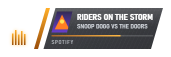

# TRAX

An EA TRAX-inspired now-playing overlay for **OBS Studio on Windows**. Install
the plugin, add a **TRAX Now Playing** source, and let your music announce itself
with angled panels, racing-style light trails, metallic sweeps, and animated bars.


The native plugin reads Windows media sessions directly and runs inside OBS.
It needs **no Node.js, Python, separate server, API keys, or account**. Settings
live in the source's Properties dialog.

## Install

**Requirements:** Windows 10 or 11, x64 OBS Studio with Browser Source support.
The plugin has been tested with **OBS 30.2.2**; other OBS versions have not been
verified.

### Download the installer

1. Open the [latest release](https://github.com/jfarre20/trax/releases/latest).
2. Under **Assets**, download `trax-<version>-setup.exe`.
3. **Close OBS**, then run the installer. Windows will request
   administrator permission to install the plugin.
4. Reopen OBS. In **Sources**, click **+ → TRAX Now Playing**.
5. Start playing music, or open **Properties → Test → Send test track**.

For development builds, open the [OBS plugin workflow](https://github.com/jfarre20/trax/actions/workflows/plugin.yml),
select a successful **master** run, and download its `trax-obs-plugin-<version>`
artifact. GitHub requires sign-in for Actions artifacts; release downloads do not.

### Manual installation

The release also includes `trax-<version>-windows-x64.zip`. With OBS closed,
extract its `trax` folder into:

```text
C:\ProgramData\obs-studio\plugins\
```

The resulting plugin file should be:

```text
C:\ProgramData\obs-studio\plugins\trax\bin\64bit\trax.dll
```

Keep the accompanying `trax/data` folder beside `trax/bin`. OBS on Windows loads
this plugin from **ProgramData**, not AppData.

### Update or uninstall

To update, close OBS, run the newer installer, and reopen OBS. Restarting also
clears OBS's cached overlay files so the new visuals load.

To uninstall an installer-based copy, close OBS and remove **TRAX Now Playing**
from Windows **Installed apps / Add or remove programs**. For a manual ZIP
installation, close OBS and remove the `trax` folder from the plugin directory.

## Set up your overlay

Drag and scale the source with OBS's normal scene transforms. Its default
**760 × 220** source size leaves room for the card, glows, and badge movement.
Increase **Source width** or **Source height** in Properties if a larger scale,
long title, or badge drop gets clipped.

All controls are in **TRAX Now Playing → Properties**:

| Group | What you can change |
| --- | --- |
| Size | Source dimensions, overlay scale, and maximum card width |
| Timing | Full-card duration, animation speed, mini strip, and pause behavior |
| Content | Artwork, artist, album, source app, progress, time, and scrolling text |
| Look | Accent colors, artwork-derived colors, opacity, scanlines, noise, and shake |
| Exit | Retract completely or collapse to a badge; badge mark, title, and drop |
| Media source | Follow a particular app or ignore selected apps |
| Audio | Drive the equalizer from an OBS mixer input |
| Test | Send a sample track, show or hide the overlay, and display debug details |

### Full card, mini strip, or badge

The full card announces a new track, then stays for **Show for** seconds. Choose
**Always visible** to keep it open, or let it settle into a smaller state.

Enable **Then collapse to mini strip** for a compact panel with artwork, title,
artist, and optional progress. **Mini strip stays for (0 = forever)** controls
whether it remains there or continues to the selected exit.



Set **When hiding → Collapse to badge** to leave the animated music mark behind.
It briefly spells out “Music,” cycles through its marks, then rests on your
chosen equalizer, speaker, or note. The title and delayed downward movement are
optional.


Choose **Retract** instead to clear the overlay completely. Ordinary playback
progress does not replay the track announcement.

### Audio-reactive equalizer

Enable **Drive the bars from audio**, then select an **Audio source** from the
OBS mixer. The native plugin reads OBS's volume meter directly; no WebSocket
server or password is needed. Leaving the source blank follows the first audio
source OBS reports.

The bars respond to loudness, with different delays and decay per bar. They are
a stylized level meter rather than a frequency spectrum. Without an audio feed,
the overlay uses its built-in bar animation.

## Supported media players

TRAX reads Windows **System Media Transport Controls (SMTC)**, the same media
sessions used by Windows playback controls. Apps such as Spotify, Media Player,
browsers, and MusicBee can supply these sessions; availability and metadata
depend on each app's version and settings. Some players, including foobar2000,
may need a media-control component.

If Windows does not show a track in its media controls, TRAX cannot read it.
Missing artwork uses a music-note fallback, and missing duration hides the
progress bar. Use **Follow this app** if multiple players are active.

## Troubleshooting

**“TRAX Now Playing” is missing from Sources.** Restart OBS after installing.
Check the ProgramData path above, including both `bin/64bit/trax.dll` and the
`data` folder. The OBS log should contain `[trax]` messages. This plugin is
Windows-only and has been verified on OBS 30.2.2.

**The source is blank.** Try **Properties → Test → Send test track**. If the
sample appears, check that your player publishes a Windows media session and
that **Follow this app** or **Ignore apps** is not excluding it. Paused tracks
are hidden unless **Stay up while paused** is enabled.

**The card or badge is cut off.** Increase the source dimensions in **Size**,
or reduce **Scale** or **Badge drop distance**.

**Audio-reactive bars do not move.** Select the intended mixer input under
**Audio source** and confirm that its meter moves in OBS.

**Updated visuals do not appear.** Fully close and reopen OBS. Reloading the
browser source alone can leave cached CSS and JavaScript in use.

## Build from source

Install Rust with the Windows MSVC toolchain and the Visual C++ build tools.
No OBS SDK download is required. Inno Setup is needed only for the `.exe`
installer; without it, packaging still produces the ZIP.

```powershell
cd obs-plugin
.\build.ps1                  # Build the release DLL
.\build.ps1 install          # Build and install into OBS (close OBS first)
.\build.ps1 package          # Build ZIP and, if available, setup.exe in dist/
.\build.ps1 status           # Compare built and installed versions
```

Use `-Elevate` when installation needs administrator permission. To install
Inno Setup: `winget install JRSoftware.InnoSetup`.

See [plugin development notes](obs-plugin/README.md) for architecture, logging,
media test tools, and platform details. Both hosts share `overlay.html`,
`overlay.css`, and `overlay.js`; the plugin packages these files into its data
folder.

Run the tests from the repository root:

```powershell
node test/run.js
cargo test --manifest-path obs-plugin/Cargo.toml
```

The suites cover track-change detection, timeline interpolation, and settings.
For visual verification in OBS itself, use
`node test/obs-shot.js "TRAX Now Playing" out.png 760 220` with your source name.
This development screenshot tool uses obs-websocket; the plugin itself does not.

## Alternative: local browser-source version

The original Node.js version remains available for a Browser Source URL, a
web-based configuration page with live preview, or custom badge images.

See the [browser-source setup guide](docs/browser-source.md) for requirements,
`npm start`, configuration, and troubleshooting. Those Node/Python and
obs-websocket instructions apply to that version; the native plugin is installed
and configured through OBS as described above.
