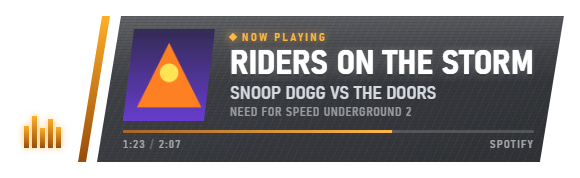

# Browser source (Node.js)

For the native OBS plugin and Windows installer, see the [main README](../README.md).
This guide covers the optional local-server version.

An EA Trax-inspired "Now Playing" overlay for OBS, driven by whatever your
desktop thinks is playing. Angled glossy panels, fast diagonal wipes, an animated
equalizer, scanlines, and a snap of UI shake on the reveal.



On Windows it reads the Global System Media Transport Controls (SMTC) session —
the same source as the volume OSD — so it works with Spotify, Media Player,
browsers, MusicBee, foobar2000, and anything else that registers a media session.
On Linux it reads MPRIS over D-Bus, the same source `playerctl` and the desktop's
own media widget use, which covers Spotify, mpv, VLC, Rhythmbox and browsers. No
screen scraping, no API keys, no accounts, nothing leaves your machine.

## The three states

The card doesn't just appear and vanish. It can step down through progressively
smaller states, so a stream can show the full graphic on a track change and keep
something small on screen the rest of the time.

**1. Full card** — the reveal above, held for `Show for` seconds.

**2. Mini strip** (optional) — the same panel, shrunk. Art, title, artist,
progress, source.


**3. Collapsed badge** (optional) — the panel folds away and leaves a mark where
the meter was. The two slashes and the bars read as an **M**, which briefly
completes itself to "Music" before the mark starts cycling.


Any stage can be the last one. Full → gone, full → mini → stay, full → mini →
badge, full → badge. See `Show for` / `Then collapse after` / `When hiding`.

## Requirements

- [Node.js](https://nodejs.org) 18 or newer
- **Windows 10 or 11:** Python 3 with `winsdk` (`pip install winsdk`) — recommended
- **Linux:** Python 3 with `python3-dbus` — required
  (`sudo apt install python3-dbus`, `dnf install python3-dbus`, or
  `pacman -S python-dbus`)

On Windows, Python is what reads album art and lets you pin the overlay to a
specific app. If it's missing, TRAX falls back to a PowerShell poller that still
reports title, artist, album, artwork and position, but ignores the pinning and
ignore-list settings. You'll see a line in the console when that happens.

On Linux there is no fallback poller — without `python3-dbus` the bridge has
nothing to read from. Album art works there too, but note that a player which
publishes only an HTTP artwork URL (Spotify, Chromium) needs network access for
it, because the overlay will only load artwork inlined as a `data:` URL.

## Quick start

```
npm install
npm start
```

On Windows you can instead double-click **`start.bat`**, which installs
dependencies on first run.

Add a Browser Source in OBS pointing at `http://127.0.0.1:8787/overlay`, and open
`http://127.0.0.1:8787/config` to change anything. Settings save instantly and
push to every connected overlay — no need to refresh the OBS source.

To open the config page on launch: `npm start -- --configure`.

## OBS setup

| Setting | Value |
| --- | --- |
| URL | `http://127.0.0.1:8787/overlay` |
| Width | `1920` |
| Height | `1080` |
| Use custom frame rate | on, **60 FPS** |
| Shutdown source when not visible | optional — saves a little CPU |
| Refresh browser when scene becomes active | **off** |

Leave the source at 1920×1080 even on a 720p or 1440p canvas and let OBS scale it;
the card is laid out against a 1080p baseline, and `Scale` adjusts its size within
that. Don't tick "Refresh browser when scene becomes active" — the overlay already
restores current state over its WebSocket the moment it connects, and a refresh on
every scene change would just replay the reveal.

You don't need "Interact" — the overlay takes no pointer input.

## Configuration

Everything lives at `http://127.0.0.1:8787/config`, which shows a live preview of
the real overlay at 1920×1080 alongside the controls, plus test buttons for
simulating a track, toggling pause, jumping progress, and forcing a reconnect.

Settings are written to `config.json` next to the source, created on first save.
`config.default.json` holds the shipped values and is never modified. Every value
is validated and clamped server-side, so a hand-edited `config.json` can't put the
overlay into a broken state.

### Layout
`Position` (9 anchors) · `X`/`Y offset` · `Scale` · `Maximum width`

### Timing & behaviour
- **Show for** — how long the full card stays after a track change.
- **Show always** — never hide. Ignored when the mini strip is on.
- **Collapse to mini strip** — after the hold, shrink to the compact strip.
- **Then collapse after** — how long the strip stays before collapsing on to
  `When hiding`. `0` means the strip is the final state.
- **When hiding** — `retract` wipes away to nothing; `logo` leaves the badge.
- **Badge rests on** — `eq` (bars), `speaker`, or `note`. The collapse cycles
  bars → note → speaker and settles here.
- **Badge drops by / after** — once collapsed, the whole badge slides down by this
  much, this long after settling. Tucks it into the corner without moving during
  the animation.
- **Show title on the badge** — keeps a truncated track title under the mark.
- **Badge image** — a relative filename (e.g. `assets/logo.png`) to use instead of
  the built-in marks.
- **Animation speed** — divides every duration and delay. 1× is a ~880 ms reveal.
- **Stay visible when paused**, **Replay on resume**, **Minimum pause before
  replay** — a long pause can re-announce the track; a brief skip-back shouldn't.

### Content
`Album art` · `Artist` · `Album` · `Source app` · `Progress bar` ·
`Elapsed / total time` · `Text case` · `Scroll long titles` · `Truncate title at`

Long lines scroll rather than truncate when `Scroll long titles` is on — worth
leaving on for browser sources, which routinely put a whole paragraph in the
artist field.

### Appearance
`Accent` / `Secondary accent` · `Derive accents from artwork` · `Panel opacity` ·
`Blur` · `Scanline intensity` · `CRT noise` · `UI shake` · `Font family`

Accent changes crossfade rather than snap, including artwork-derived ones.

### Audio-reactive bars
Drives the equalizer from **obs-websocket** volume meters, so the bars follow what
is actually going out on stream and can be pointed at a single input. Enable the
WebSocket Server in OBS under *Tools*, then set the port, password, and source
name here.

This is a level meter, not a spectrum: obs-websocket reports loudness with no
frequency breakdown. The bars are auto-gained against a rolling peak and given
per-bar decay and a small delay so they read as a meter rather than one solid
block moving together.

### Media session
**Pin to app** (substring, e.g. `Spotify`) · **Ignore apps** (comma separated).
The default selection prefers a session that's actually playing and then sticks
with it, so it shouldn't ping-pong between idle browser tabs.

## Architecture

```
nowplaying.py         Media poller. Prints one JSON line per second on stdout.
  nowplaying.ps1      Windows SMTC, and the fallback when Python is unavailable.
  nowplaying-linux.py Linux MPRIS over D-Bus.
        |
media-bridge.js       Supervises the poller. Runs each sample through the
        |             detector, uploads artwork once per track, forwards events.
track-change.js       Decides *what changed*. Pure, no I/O, unit tested.
        |
server.js             WebSocket relay + REST + static hosting + artwork cache.
        |
overlay.js / .css     Renders the card and runs the animation state machine.

obs-bridge.js         Optional. obs-websocket -> audio levels -> overlay.
```

The poller is a process boundary that speaks JSON lines, so replacing it with a C#
helper means matching that contract and changing nothing else.

### Two things SMTC will mislead you about

Both cost real debugging time and are worth knowing before you touch the timeline
code.

**Position is a snapshot, not a clock.** `GetTimelineProperties().Position` is
whatever the app last pushed via `UpdateTimelineProperties`, and most apps push it
once at track start and never again — a Brave session was observed holding
`0.016` for 30+ seconds of audible playback. The fix is `LastUpdatedTime`: the
real position while playing is `position + (now - lastUpdated)`. Without that
correction, anything starting mid-track reads the value from track start and is
behind by however long the track had been playing. This is what the volume OSD
does too.

**Duration is fine, but not always in `EndTime`.** Some apps leave it zero and
populate `MaxSeekTime` instead, so the poller falls back to that.

A corollary: don't "correct" a stale position with a tolerance check. The longer a
track plays, the further a frozen value diverges, so "only adopt it when it
disagrees a lot" adopts it every single time. The overlay instead gates by message
type — only a track change, a real play/pause edge, or a confirmed `timeline`
event may move the interpolation anchor.

### Why track-change detection is its own module

The poller reports the *same track* about once a second. Naively broadcasting that
would make the overlay replay its reveal continuously. `track-change.js` compares
a stable identity key (`session|title|artist`) and can only emit `trackChanged`
when that key actually changes; movement is downgraded to a cheap `timeline`
message the overlay never animates on, and a *stalled* position emits nothing at
all. Those properties are pinned by tests.

### Endpoints

| Method | Path | Purpose |
| --- | --- | --- |
| GET | `/overlay` | the OBS browser source |
| GET | `/config` | config page with live preview |
| GET | `/preview` | standalone demo, works with no poller running |
| GET | `/api/health` | `{ ok, uptime, clients, poller }` |
| GET | `/api/now-playing` | current state, position interpolated to now |
| GET | `/api/sessions` | media sessions the poller last reported |
| GET/POST | `/api/config` | read / write configuration |
| GET | `/api/artwork/<hash>` | cached album art |
| POST | `/api/test` | inject a simulated track change |
| POST | `/api/command` | `show` / `hide` / `test` / `reconnect` |
| WS | `/ws` | overlay connection; primed with config + state on connect |

Message types: `state`, `trackChanged`, `playbackChanged`, `timeline`,
`configChanged`, `sessions`, `levels`, `show`, `hide`, `test`.

## Testing

```
npm test                      unit tests: change detection + config validation
node test/verify-live.js      end-to-end against a running instance
```

Tools for looking at the animation, all driving a real browser over the DevTools
protocol:

```
node test/watch-phases.js 20 --shots   log every phase change, optionally per-frame PNGs
node test/watch-elapsed.js 60          assert elapsed time never goes backwards
node test/shoot.js <url> out.png 2600  single screenshot with a transparent alpha channel
node test/capture-docs.js              regenerate the README screenshots
```

These use the real clock deliberately. `chrome --screenshot
--virtual-time-budget` does **not** advance CSS transitions (and doesn't advance
them at all in subframes), so that path reports a progress bar stuck at zero width
and a card positioned against a viewport shorter than the one requested. Both are
artifacts of the capture path, not overlay bugs — but they cost an hour to rule
out.

One more trap, since it bit twice: **don't give a state class on `#card` the same
name as a child element's class.** `.badge-word { opacity: 0 }` matching the card
blanked the entire overlay, and with `badge` on the card,
`document.querySelector('.badge')` returns the *card* (earlier in document order),
which quietly makes every measurement wrong. State classes are `collapsed`,
`word-on`, `badge-dropped`, `mini`, `intro`.

## Troubleshooting

**The overlay never appears.** Check `/api/health`. If `poller` is `false`, no
metadata is arriving — see below. If it's `true` but nothing shows, open the config
page and press "Simulate new track"; if that animates, the pipeline is fine and the
issue is metadata.

**An app is playing but Windows doesn't know.** Not every player publishes a media
session. Check the ground truth: press a media key, or open the volume flyout — if
Windows shows no track there, TRAX can't see one either.

- **Spotify, Media Player, Groove, browsers, MusicBee** — work out of the box.
- **foobar2000** — needs a component such as *foo_mediacontrol*.
- **VLC** — publishes a session on recent builds, often with no artwork and no
  reliable duration.
- **Winamp, older players, most DAWs, most games** — no SMTC session at all.
- **Browser tabs** report the *page* title, and put the page description in the
  artist field. Expect long artist lines; the marquee handles them.

**Metadata is incomplete.** Turn off the fields an app doesn't provide. The overlay
already hides the progress bar when duration is zero, which is common for streams.

**It follows the wrong app.** Pin it, or add the offender to the ignore list.

**No album art.** Needs the Python poller (`pip install winsdk` on Windows,
`python3-dbus` on Linux). Some apps publish
metadata with no thumbnail at all — the overlay falls back to a ♪ glyph.

**The animation replays during a song.** It should be structurally impossible.
Check whether the app rewrites its title mid-track (some browsers do on ad breaks),
and that "Refresh browser when scene becomes active" is off in OBS.

**Elapsed time jumps backwards.** Shouldn't happen; `test/watch-elapsed.js` guards
it. If it does, the app is republishing a position that disagrees with reality.

**Audio bars don't move.** Check the console for `[obs]` lines — it will tell you
if authentication failed or if the source name doesn't match any OBS input.

**It stopped after I restarted the backend.** It reconnects on its own with
exponential backoff up to 15 s. While disconnected it hides rather than showing an
error, so a dead backend looks like an empty overlay, never a broken one on stream.

## Security

- Binds to `127.0.0.1` only. Opening it to the LAN is an explicit setting, and a
  LAN-connected overlay is read-only — only loopback clients can push state or
  change configuration.
- All config values are type-checked and range-clamped; colours must be hex
  literals and the font stack is character-restricted, because both are written
  into CSS custom properties. The badge image path must be a safe relative
  filename.
- Artwork is served from an in-memory map keyed by content hash. No filesystem path
  is ever built from a request, so the artwork route can't read files.
- `config.json` is not served as a static file, and is gitignored — it holds your
  obs-websocket password.
- Track metadata is rendered from text nodes only and is never interpreted as HTML.
- No administrator privileges required.

## Known gaps

**Verified against live playback** with a browser session: title, artwork,
duration, position, playback status and app name all populate correctly, the reveal
fires exactly once per track change, and elapsed time advances monotonically
across heartbeats and source reloads.

Still unverified in practice:

- Field population for non-browser apps (Spotify, MusicBee, foobar2000) — how each
  formats artist/album will differ from the browser case.
- `GetTimelineProperties` on apps that leave it zeroed or stale.
- Thumbnail streams from apps returning something other than PNG/JPEG.
- `SourceAppUserModelId` shapes for Store-packaged apps. The trimming handles
  `...!App` and package-family forms, but real ids vary more than can be guessed.
- Rapid session churn (a media app exiting mid-call surfaces as
  `RPC_E_DISCONNECTED`). Caught and reported as stopped, then recovered on the next
  poll, but the timing hasn't been observed live.
- Multiple simultaneous sessions, so pinning and the ignore list are untested
  against real contention.

Run with **Debug readout** enabled to see the parsed state on the overlay itself,
and watch the console for `[media]`, `[poller]` and `[obs]` lines.

## Layout

```
trax/
├── server.js             relay + REST + static + artwork cache
├── media-bridge.js       poller supervision and transport
├── obs-bridge.js         obs-websocket audio levels (optional)
├── track-change.js       change detection (pure, tested)
├── config-store.js       load / validate / save
├── nowplaying.py         SMTC poller, Windows (winsdk)
├── nowplaying.ps1        SMTC poller fallback, Windows
├── nowplaying-linux.py   MPRIS poller, Linux (python3-dbus)
├── overlay.html/.css/.js the OBS browser source
├── config.html/.js       configuration UI
├── preview.html          standalone demo, no backend needed
├── start.js / start.bat  launcher
├── config.default.json   shipped defaults
├── docs/                 screenshots
└── test/
    ├── run.js            unit tests
    ├── verify-live.js    end-to-end checks
    ├── watch-phases.js   animation phase timeline
    ├── watch-elapsed.js  elapsed-time regression guard
    ├── shoot.js          single screenshot
    └── capture-docs.js   README screenshots
```
